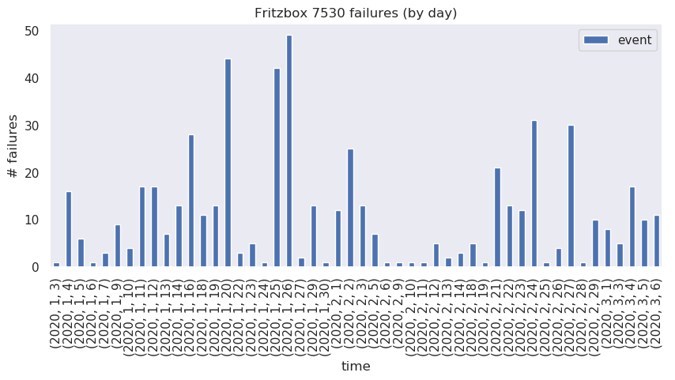
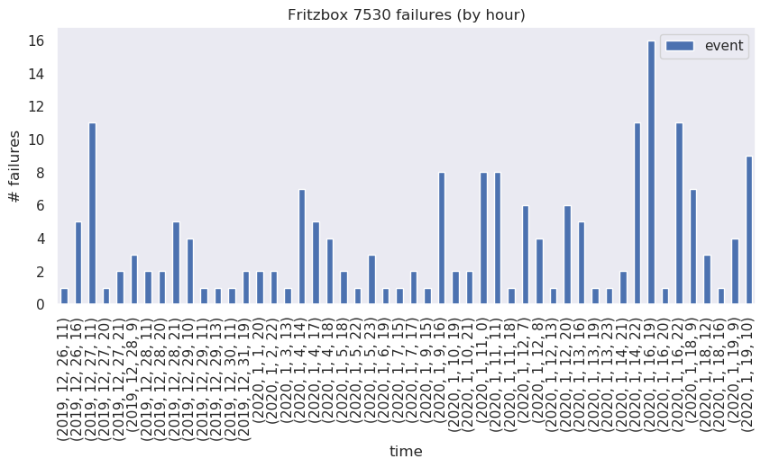

[](https://travis-ci.org/paulknewton/fritz-monitor)
[](https://codecov.io/gh/paulknewton/fritz/monitor)

[](https://deepsource.io/gh/paulknewton/fritz-monitor/?ref=repository-badge)

# fritz-monitor
Monitor the internet health of a Fritz!Box router and plot graphs of errors





## How does it work?

The tools use the [fritzconnection](https://github.com/kbr/fritzconnection) libraries.
System logs are downloaded from the Fritz!Box on a periodic basis and stored on a local filesystem.
When the program is executed in 'statistics' mode, it reads all of the logs, and searches for key strings that indicate errors. These errors are used to populate a pandas Dataframe which are then converted to pretty graphs via matplotlib.

The tools support different command-line arguments for accessing the router (user, password etc) or when storing the graphs (log directory, output folder, graphs titles etc).

## Installation

All dependencies are listed in `requirements.txt`. Install everything via `pip`:
```
pip install -r requirements.txt
```

## Usage

Just run the `fritz.py` program. The `-h` flag lists all the possible arguments:

```
./fritz.py -h

usage: fritz.py [-h] [-i [ADDRESS]] [-u [USER]] [-p [PASSWORD]]
                [--port [PORT]] [--logdir LOGDIR] [--title TITLE]
                [--output OUTPUT] [--prefix PREFIX]
                {log,stats}

FritzBox Monitor

positional arguments:
  {log,stats}           action to perform

optional arguments:
  -h, --help            show this help message and exit
  -i [ADDRESS], --ip-address [ADDRESS]
                        ip-address of the FritzBox to connect to. Default:
                        169.254.1.1
  -u [USER], --user [USER]
                        Fritzbox authentication username
  -p [PASSWORD], --password [PASSWORD]
                        Fritzbox authentication password
  --port [PORT]         port of the FritzBox to connect to. Default: 49000
  --logdir LOGDIR       folder where logs are stored
  --title TITLE         title used on graphs
  --output OUTPUT       folder to store graphs
  --prefix PREFIX       prefix added to graph filenames
```

The tool supports 2 operating modes:
* log - extract a log from the router
* stats - build graphs from the log files

e.g.
```
./fritz.py log -p somepass > logs/fritz.log
```

will dump out the last system log from the router to the `fritz.log` file (in the `logs` folder).

```
./fritz.py stats -title "Errors in my router" --logdir logs --output docs
```

will create some graphs from any log files found in the `logs` folder, and store the graphs in the `docs` folder.
